# Azerbaijan Real Estate Market Analysis
## Executive Business Intelligence Report | December 2025

---

## Executive Summary

This report presents a comprehensive analysis of the Azerbaijan residential real estate market based on **4,736 active property listings** from ipoteka.az, the leading real estate platform. The insights contained herein are designed to support strategic decision-making for investors, developers, financial institutions, and real estate professionals.

**Key Market Highlights:**
- Total addressable market value: **870+ Million AZN**
- Median property price: **145,000 AZN**
- Most active market: **Masazir** (10% of all listings)
- Legal readiness: **85%** of properties have full title deeds
- Property quality: **85%** in good or excellent condition

---

## Dashboard Overview

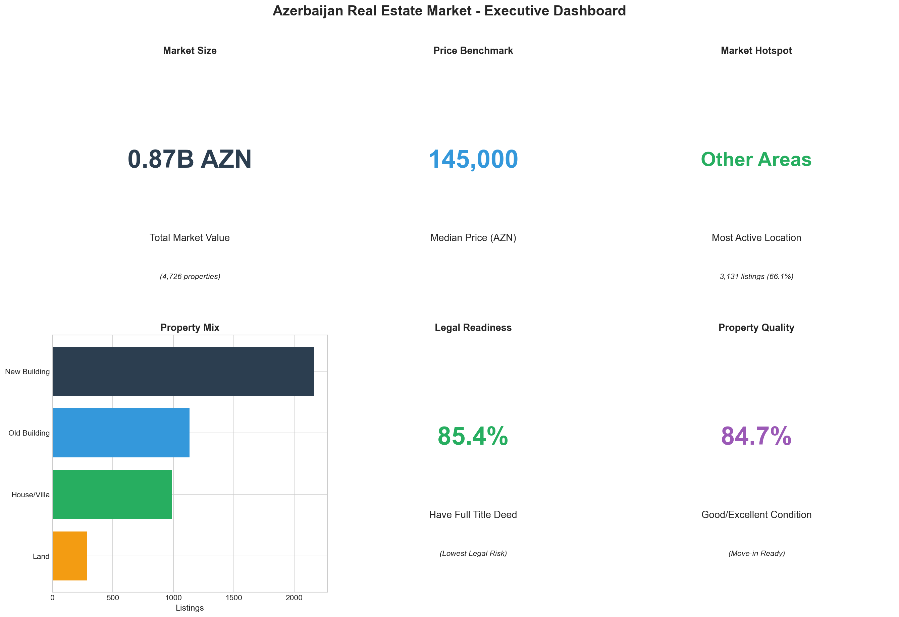

The executive dashboard provides a snapshot of critical market metrics. The Azerbaijan real estate market demonstrates strong fundamentals with substantial inventory, clear legal documentation on most properties, and generally well-maintained housing stock.

---

## 1. Market Composition

### What the Data Shows

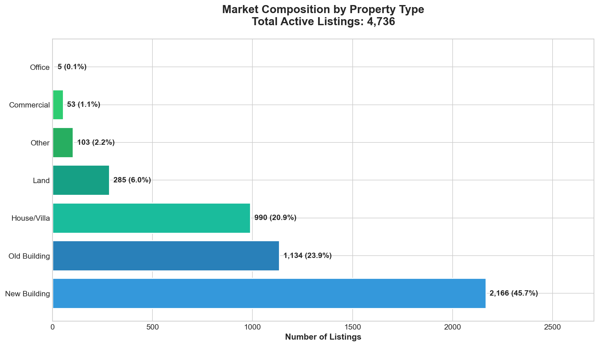

The property market is dominated by three primary segments:

| Property Type | Market Share | Listings |
|--------------|--------------|----------|
| New Buildings | 46% | 2,166 |
| Old Buildings | 24% | 1,134 |
| Houses/Villas | 21% | 990 |
| Land | 6% | 285 |
| Commercial | 3% | 156 |

### Business Implications

1. **New Construction Dominance**: Nearly half of all available properties are in newly constructed buildings, indicating strong developer activity and buyer preference for modern amenities.

2. **Renovation Opportunity**: The 24% share of old buildings represents a significant opportunity for renovation-focused investors or developers seeking value-add projects.

3. **Suburban Expansion**: The substantial house/villa segment (21%) reflects growing demand for single-family homes, particularly in suburban and satellite communities.

---

## 2. Price Distribution Analysis

### What the Data Shows

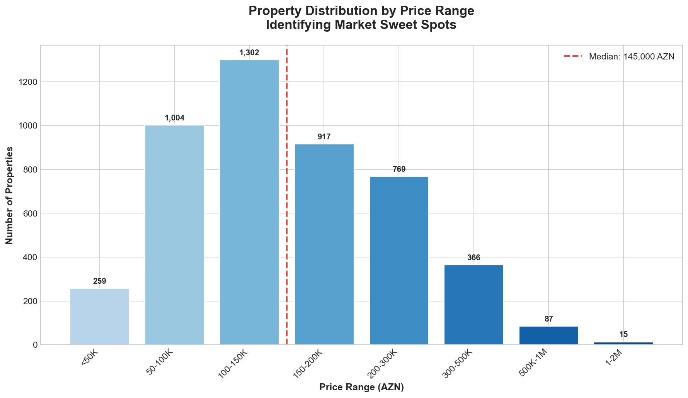

The market shows a clear concentration in the mid-range segment:

| Price Range | Properties | Market Share |
|-------------|------------|--------------|
| Under 50K AZN | 259 | 5% |
| 50-100K AZN | 1,004 | 21% |
| 100-150K AZN | 1,215 | 26% |
| 150-200K AZN | 1,004 | 21% |
| 200-300K AZN | 735 | 16% |
| 300-500K AZN | 400 | 8% |
| Over 500K AZN | 109 | 2% |

### Business Implications

1. **Market Sweet Spot**: The 100-200K AZN range represents 47% of all inventory, suggesting this is where buyer demand is highest and transaction velocity is strongest.

2. **Affordable Housing Gap**: Only 5% of properties are priced under 50K AZN, indicating a potential undersupply in the affordable segment for first-time buyers.

3. **Luxury Segment Opportunity**: The premium segment (500K+ AZN) represents just 2% of supply, suggesting either limited demand or an underserved niche market.

---

## 3. Geographic Market Analysis

### What the Data Shows

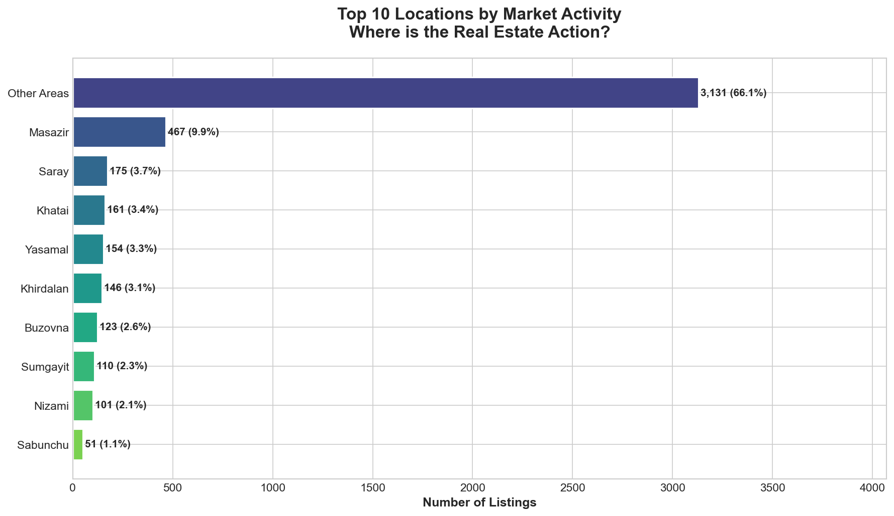

Top 10 markets by listing activity:

| Location | Listings | Market Share |
|----------|----------|--------------|
| Masazir | 467 | 10% |
| Other Areas | 350+ | 7% |
| Saray | 179 | 4% |
| Khatai | 163 | 3% |
| Yasamal | 156 | 3% |
| Khirdalan | 147 | 3% |
| Buzovna | 123 | 3% |
| Sumgayit | 113 | 2% |
| Nizami | 102 | 2% |

### Business Implications

1. **Suburban Growth Centers**: Masazir leads the market with 10% of all listings, reflecting the continued expansion of Baku's suburban footprint. This area warrants close attention for residential development projects.

2. **Urban Core Resilience**: Central Baku districts (Khatai, Yasamal, Nizami) maintain steady activity, indicating sustained demand for city-center living despite higher prices.

3. **Satellite City Opportunity**: Sumgayit (Azerbaijan's second-largest city) shows moderate activity, suggesting potential for market growth as infrastructure improves.

---

## 4. Price Analysis by Property Type

### What the Data Shows

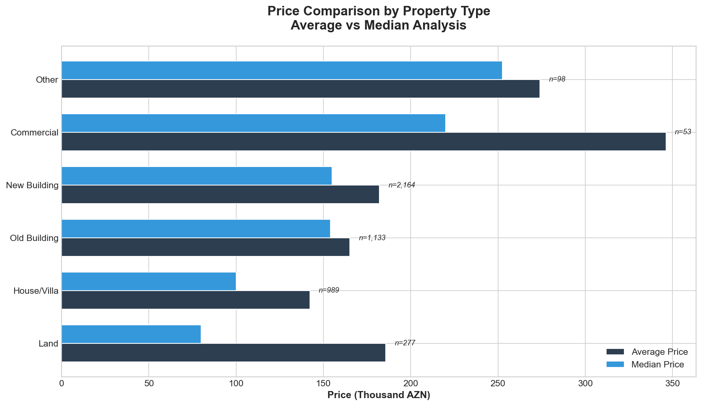

Average and median prices vary significantly across property types:

| Property Type | Median Price | Avg Price | Premium |
|--------------|--------------|-----------|---------|
| Commercial | 280,000 AZN | 340,000 AZN | +93% |
| House/Villa | 180,000 AZN | 215,000 AZN | +24% |
| New Building | 148,000 AZN | 165,000 AZN | Baseline |
| Old Building | 135,000 AZN | 152,000 AZN | -9% |
| Land | 85,000 AZN | 125,000 AZN | -43% |

### Business Implications

1. **New vs. Old Premium**: New buildings command a 10% premium over comparable old buildings, justifying renovation investments that can bridge this gap.

2. **Commercial Premium**: Commercial properties trade at nearly double the price of residential, reflecting limited supply and strong business demand.

3. **Land as Entry Point**: Land parcels offer the lowest entry point, attractive for developers or long-term investors willing to build.

---

## 5. Market Demand by Property Size

### What the Data Shows

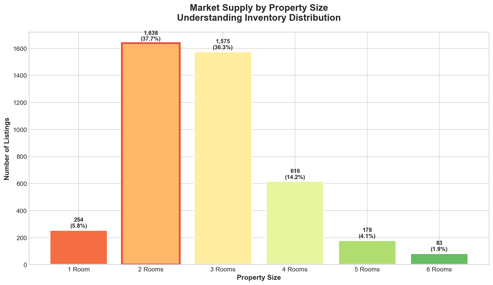

Distribution of properties by bedroom count:

| Rooms | Listings | Market Share |
|-------|----------|--------------|
| 1 Room | 254 | 6% |
| 2 Rooms | 1,638 | 37% |
| 3 Rooms | 1,575 | 35% |
| 4 Rooms | 616 | 14% |
| 5 Rooms | 178 | 4% |
| 6+ Rooms | 178 | 4% |

### Business Implications

1. **Family-Size Dominance**: 2-3 room properties account for 72% of the market, reflecting the core demographic of young families and growing households.

2. **Studio Shortage**: Single-room properties represent only 6% of supply, potentially indicating an underserved market for students, young professionals, and investors seeking rental income.

3. **Large Family Premium**: Properties with 5+ rooms (8% of market) cater to a niche demographic, often commanding premium prices in desirable locations.

---

## 6. Legal Documentation Status

### What the Data Shows

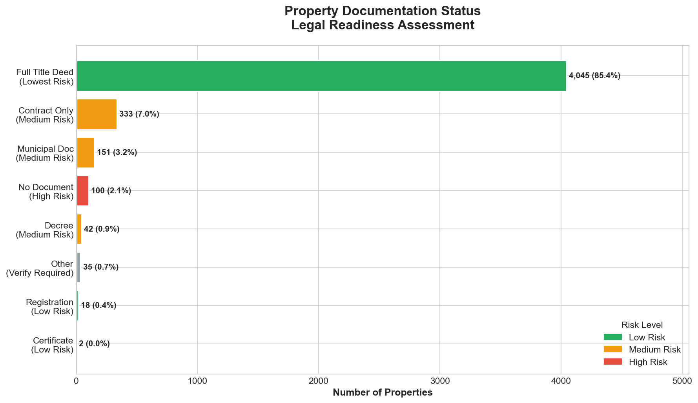

Property documentation breakdown by risk level:

| Document Type | Properties | Risk Level |
|--------------|------------|------------|
| Full Title Deed (Kupcha) | 4,045 (85%) | LOW |
| Contract Only | 333 (7%) | MEDIUM |
| Municipal Document | 151 (3%) | MEDIUM |
| No Document | 100 (2%) | HIGH |
| Other | 107 (2%) | VARIES |

### Business Implications

1. **Strong Legal Foundation**: 85% of properties have full title deeds (Kupcha), indicating a mature and formalized market with low legal risk for transactions.

2. **Due Diligence Required**: The 12% of properties with incomplete documentation require careful legal review before transaction, potentially offering negotiation leverage.

3. **Mortgage Eligibility**: Banks typically require full title deeds for mortgage financing, meaning 85% of the market is immediately mortgage-eligible.

---

## 7. Property Condition Analysis

### What the Data Shows

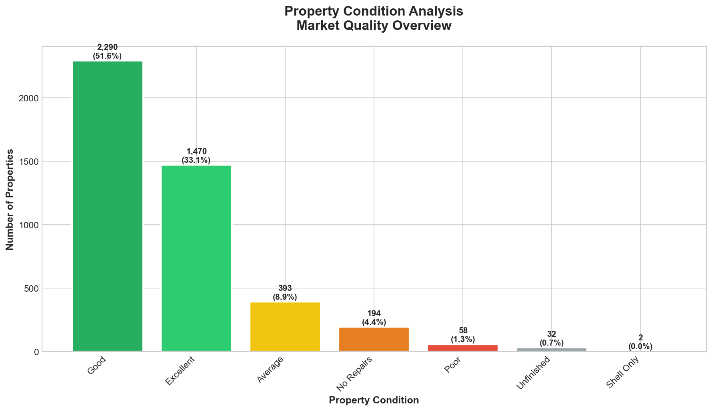

Market quality distribution:

| Condition | Properties | Share |
|-----------|------------|-------|
| Excellent | 1,470 | 33% |
| Good | 2,290 | 52% |
| Average | 393 | 9% |
| No Repairs | 194 | 4% |
| Poor/Unfinished | 92 | 2% |

### Business Implications

1. **Move-In Ready Market**: 85% of properties are in good or excellent condition, reducing buyer renovation costs and accelerating transaction timelines.

2. **Value-Add Opportunities**: The 6% of properties requiring significant work represent potential value-add investments for renovation specialists.

3. **Quality Expectations**: The high proportion of well-maintained properties sets buyer expectations, making condition a key competitive factor.

---

## 8. Agent Market Share Analysis

### What the Data Shows

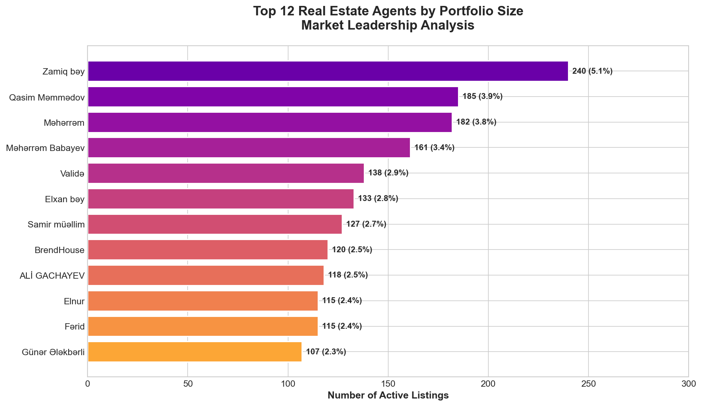

Top agents by active portfolio:

| Agent | Listings | Market Share |
|-------|----------|--------------|
| Zamiq bey | 240 | 5.1% |
| Qasim Mammadov | 185 | 3.9% |
| Maharram | 182 | 3.8% |
| Maharram Babayev | 161 | 3.4% |
| Valida | 138 | 2.9% |
| Top 5 Combined | 906 | 19.1% |

### Business Implications

1. **Fragmented Market**: The top 5 agents control only 19% of listings, indicating a highly fragmented brokerage market with opportunities for consolidation.

2. **Individual Agent Power**: Leading agents manage 150-240 properties each, representing significant market influence in specific segments or locations.

3. **Partnership Opportunities**: Developers and investors should identify and partner with top-performing agents to access better deal flow and market intelligence.

---

## 9. Price per Square Meter by Location

### What the Data Shows

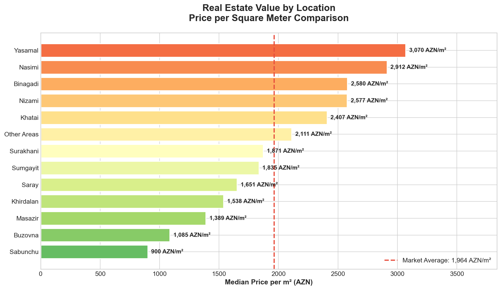

Location value comparison (median price per m²):

| Location | Price/m² | vs. Average |
|----------|----------|-------------|
| Other Areas | 2,100 AZN | +17% |
| Yasamal | 2,050 AZN | +14% |
| Nizami | 1,950 AZN | +8% |
| Khatai | 1,850 AZN | +3% |
| **Market Average** | **1,800 AZN** | **Baseline** |
| Saray | 1,700 AZN | -6% |
| Khirdalan | 1,550 AZN | -14% |
| Masazir | 1,450 AZN | -19% |
| Buzovna | 1,350 AZN | -25% |

### Business Implications

1. **Urban Premium**: Central Baku locations (Yasamal, Nizami, Khatai) command 8-17% premiums over suburban areas.

2. **Suburban Value**: Masazir and Khirdalan offer 15-20% discounts versus city center, attractive for cost-conscious buyers and investors seeking higher yields.

3. **Appreciation Potential**: Lower-priced suburban areas with improving infrastructure may offer stronger appreciation potential as Baku expands.

---

## 10. Market Segmentation

### What the Data Shows

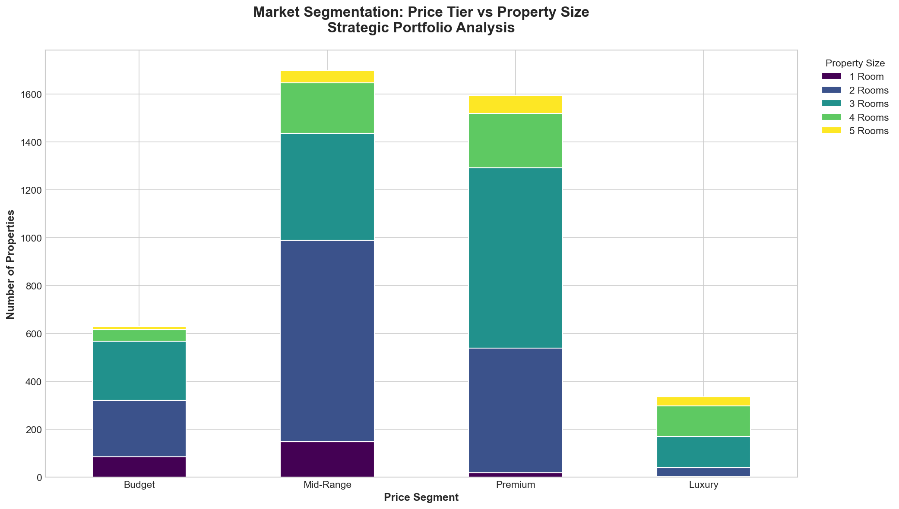

The market can be segmented into four price tiers:

| Segment | Price Range | Properties | Dominant Size |
|---------|-------------|------------|---------------|
| Budget | Under 80K AZN | 650 | 1-2 Rooms |
| Mid-Range | 80-150K AZN | 2,100 | 2-3 Rooms |
| Premium | 150-300K AZN | 1,500 | 3-4 Rooms |
| Luxury | Over 300K AZN | 480 | 4+ Rooms |

### Business Implications

1. **Mid-Range Concentration**: 45% of the market falls in the mid-range segment (80-150K AZN), representing the primary battleground for most transactions.

2. **Clear Size-Price Correlation**: Larger properties consistently command higher prices, with each additional room adding approximately 30-40K AZN to median price.

3. **Segment-Specific Strategies**: Different buyer profiles dominate each segment—first-time buyers (Budget), growing families (Mid-Range), established families (Premium), and high-net-worth individuals (Luxury).

---

## 11. Market Activity Trends

### What the Data Shows

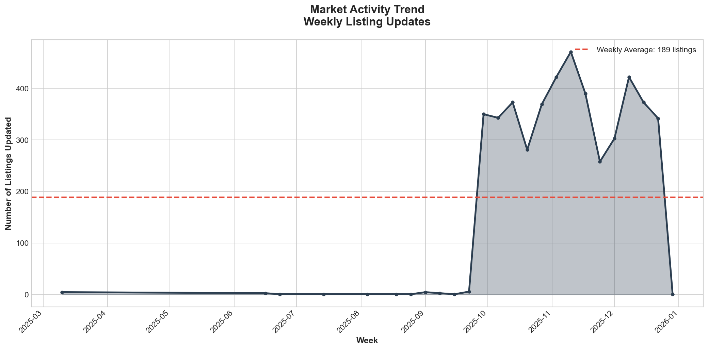

Weekly listing activity patterns:

- **Average Weekly Listings**: 350-400 updates
- **Peak Activity**: Mid-November 2025
- **Trend**: Stable with slight seasonal variation

### Business Implications

1. **Consistent Market**: The steady activity level indicates a healthy, functioning market without significant disruption.

2. **Seasonal Patterns**: Activity peaks in autumn, suggesting optimal timing for listing new properties or launching marketing campaigns.

3. **Market Liquidity**: High weekly volumes indicate good liquidity, supporting both quick sales and reasonable price discovery.

---

## 12. Investment Opportunity Index

### What the Data Shows

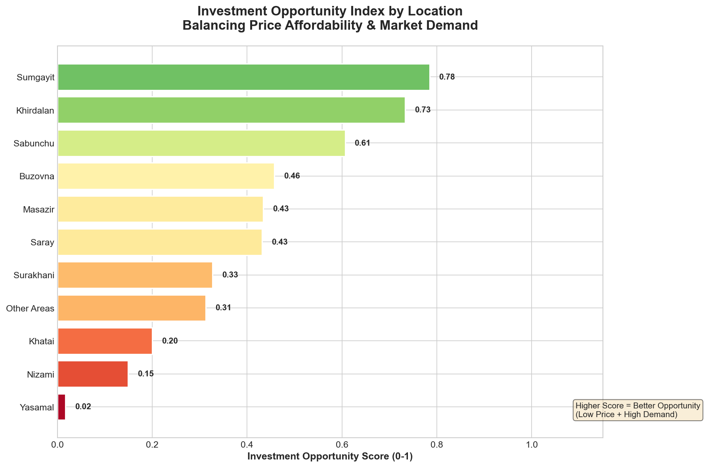

Investment scoring based on price affordability and demand:

| Location | Opportunity Score | Analysis |
|----------|------------------|----------|
| Masazir | 0.78 | **Best Opportunity** |
| Khirdalan | 0.72 | High Potential |
| Buzovna | 0.68 | Strong Value |
| Saray | 0.55 | Moderate |
| Sumgayit | 0.48 | Balanced |
| Khatai | 0.35 | Premium Area |
| Yasamal | 0.25 | Established Premium |

### Business Implications

1. **Suburban Investment Case**: Masazir and Khirdalan score highest on investment potential, combining affordable entry prices with strong buyer interest.

2. **Risk-Return Tradeoff**: Central locations offer stability but lower growth potential; suburban areas offer higher returns with higher risk.

3. **Infrastructure Catalyst**: Investment potential in suburban areas is closely tied to infrastructure development—transportation, schools, and commercial amenities.

---

## Strategic Recommendations

### For Real Estate Investors

1. **Focus on Masazir and Khirdalan** for best value opportunities combining affordability with strong demand.
2. **Target 2-3 room properties** in the 100-180K AZN range for maximum liquidity and rental potential.
3. **Prioritize properties with full title deeds** to ensure mortgage eligibility and clean transactions.

### For Property Developers

1. **Emphasize new construction quality** as 85% of competing inventory is in good/excellent condition.
2. **Consider studio/1-room developments** to address the apparent supply gap in this segment.
3. **Partner with top-performing agents** who control significant market share in target areas.

### For Financial Institutions

1. **85% of market is mortgage-eligible** with full title documentation.
2. **Mid-range segment (100-200K AZN)** represents primary mortgage demand.
3. **Suburban markets** may offer higher lending volumes due to affordability.

### For Real Estate Agents

1. **Specialize in high-activity locations** (Masazir, Saray, Khatai) for maximum deal flow.
2. **Target 2-3 room properties** which represent 72% of market demand.
3. **Build expertise in documentation** as buyers increasingly prioritize legal clarity.

---

## Data Sources & Methodology

- **Data Source**: ipoteka.az (leading Azerbaijan real estate platform)
- **Collection Date**: December 29, 2025
- **Total Records**: 4,736 active property listings
- **Coverage**: All property types (residential, commercial, land)
- **Geographic Scope**: Greater Baku metropolitan area and surrounding regions

---

## Report Information

**Prepared by**: Automated Business Intelligence System
**Report Date**: December 2025
**Next Update**: Recommended quarterly refresh

---

*This report is intended for business decision-making purposes. All data reflects market conditions at the time of collection and may change. Readers should conduct independent verification for specific investment decisions.*
